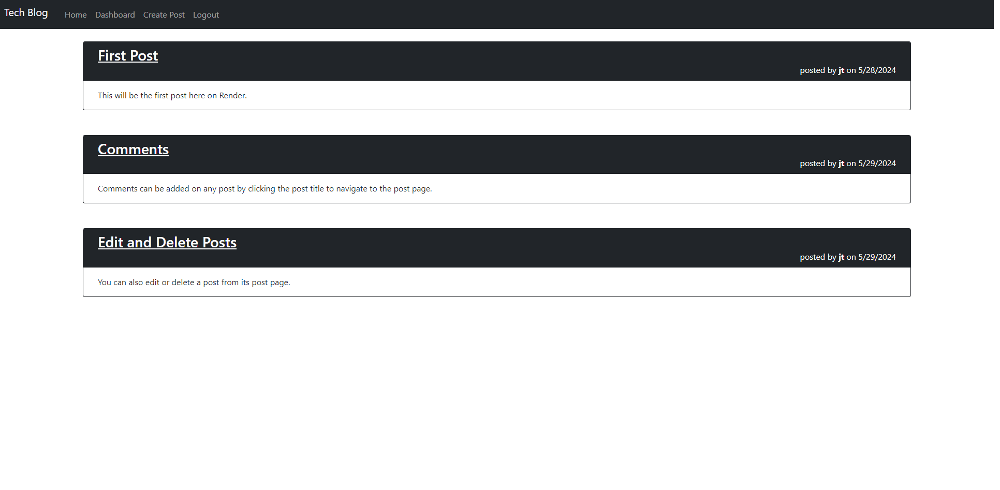
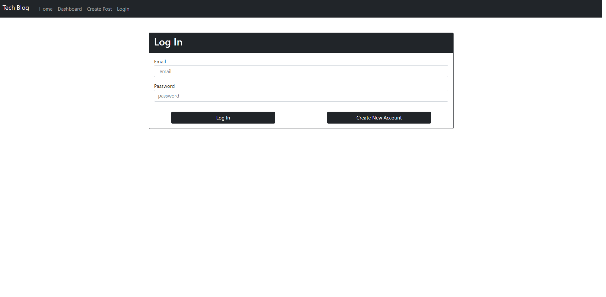

# README

## Description

A tech blog that can accept user registration and login.  Posts and comments can be created, andd posts can also be deleted or edited.

## Table of Contents

- [Visuals](#Visuals)

- [Installation](#Installation)

- [Usage](#Usage)

- [Contribute](#Contributing)

- [Tests](#Tests)

- [Questions](#Questions)

## Visuals

## Installation

None needed.  

## Usage

Navigate to the [web page](https://mvc-tech-blog-y48f.onrender.com/dashboard).  You can view all posts on the home page, but any other page will redirect to login.  Once logged in, you will be redirected to your dashboard to view your posts.  Use the navbar at the top of all pages to create posts, navigate to home or dashboard, or logout.  Clicking on a post on the home page or dashboard will take you to that post's page, where you can leave a comment.  If the post is yours, you will have the option to edit or delete the post from its page.

## Links

[Page Link](https://mvc-tech-blog-y48f.onrender.com/dashboard)

[Github Repo](https://github.com/jtschams/mvc-tech-blog)

[Github Author](https://github.com/jtschams)

## Contributing

Feel free to fork the repo if you would like to make any improvements.

## Tests

No testing is available on the render application, but you can `npm run seed` if you have cloned the repo to populate the database with sample users, posts, and comments.

## Questions

My Github account can be found at [jtschams](https://github.com/jtschams).

For any other questions, please contact me at jtschams@yahoo.com.

## License
    

The license used is MIT, which can be viewed in the repository.
